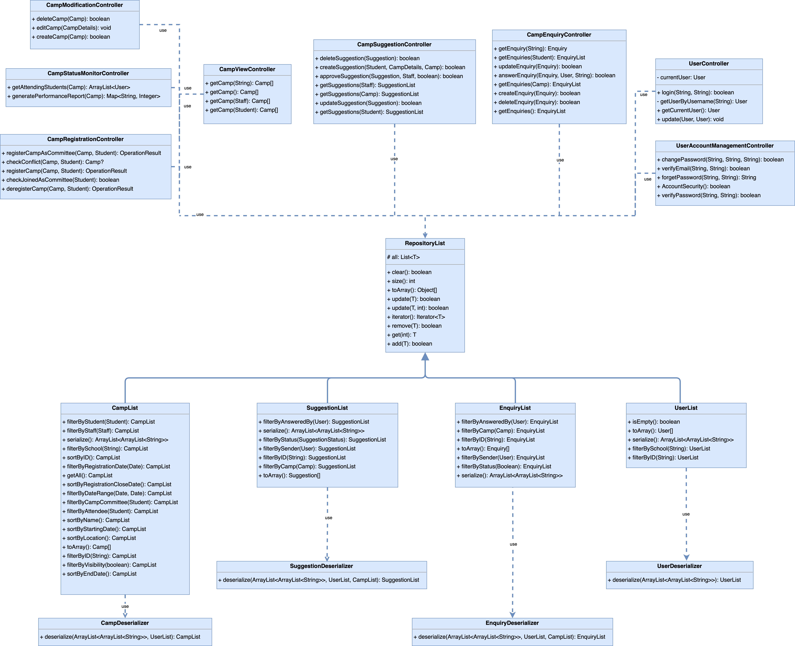
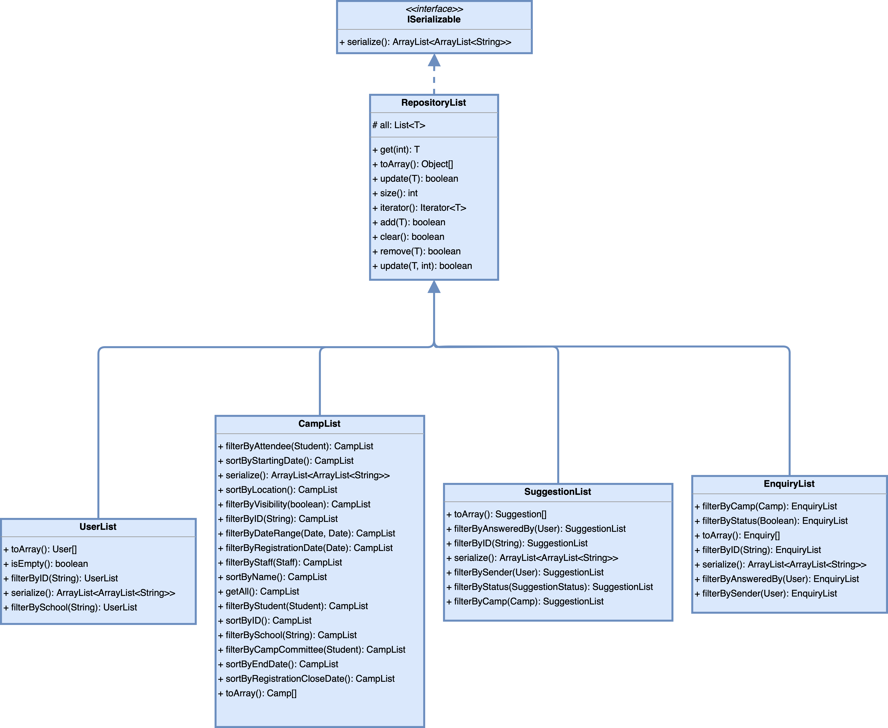

# Camp Application Management System (CAMS) - SC2002 Project

## Overview

CAMS is a Java console application developed for the SC2002 Object-Oriented Design & Programming course at Nanyang Technological University. The application focuses on reusability, extensibility, and maintainability, streamlining the management of camp applications and user interactions.

## Project Report

[View the Project Report](./SCSX-grp1.pdf)

[View the Java Documentation](./javadoc/index.html)

## Team Members

- Wang Yangming (U2222553D)
- Liau Zheng Wei (U2222032K)
- Fan Tianyu (U2222105H)
- Clayton Fernalo (U2220422E)
- Christopher Angelo (U2220148L)

## Features

- **User Authentication**: Secure login and password management.
- **Role-Based Access**: Different interfaces for students, committee members, and staff.
- **Camp Management**: Creation, editing, and deletion of camp information.
- **Participant Management**: Registration and deregistration for camps.
- **Enquiry Handling**: Management of enquiries, including creation, editing, and deletion.
- **Reports Generation**: Automated generation of reports for camp participation, enquiries, and committee performance.
- **Extensible UI**: Modular user interface components for flexibility.
- **Repository Pattern**: For efficient data storage and retrieval.

## Design Principles

1. **Single Responsibility Principle (SRP)**
   - Focuses on having each class responsible for a single purpose or actor.
2. **Open Closed Principle (OCP)**
   - Software entities should be open for extension but closed for modification.
3. **Liskov Substitution Principle (LSP)**
   - Subtypes must be substitutable for their base types.
4. **Interface Segregation Principle (ISP)**
   - Large interfaces should be split into smaller, more specific ones.
5. **Dependency Injection Principle (DIP)**
   - High-level modules should not depend on low-level modules but on abstractions.

## Technology Stack

- **Language**: Java
- **Data Storage**: CSV files for data storage

## Prerequisites

- Java JDK 21

## Running the Application

1. Run the application using the command: `java -jar out/artifacts/sc2002_test_jar2/sc2002_test.jar`
2. Follow the on-screen instructions to interact with the system.

## Documentation

For detailed documentation, refer to the `./javadoc` directory.

## UML Class Diagrams

Class diagrams can be found in the `./diagrams` folder:

### Entity Diagram

### Boundary Widgets Diagram

### Boundary Windows Diagram

### Controllers Diagram

### Interface Segregation Principle Diagram

### Open Close Principle Diagram

## Code of Conduct

We are committed to ensuring a welcoming and inclusive environment for everyone. We expect all participants in this project to adhere to our Code of Conduct. Please refer to the [Code of Conduct](CODE_OF_CONDUCT.md) for full details on our expectations and guidelines.

## License

Copyright (c) SCSX Group 1. All rights reserved.

Licensed under the [MIT](LICENSE.md) license.
